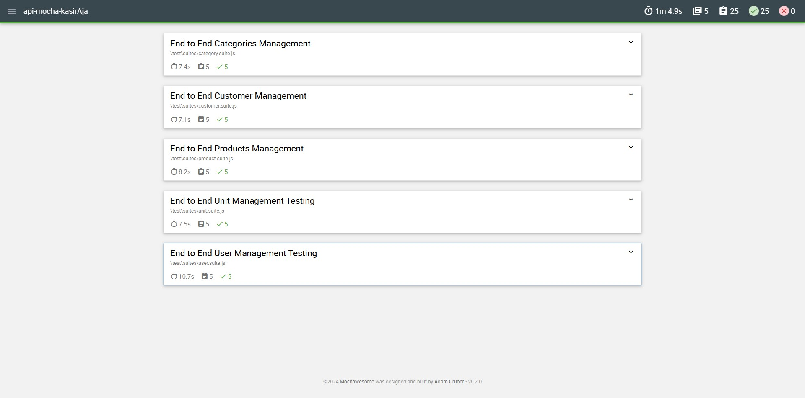

# API Automation Testing using Mocha-Chai Supertest

<p align="center">
    
</p>

This repository is the result of a project practice aimed at learning and applying API automation testing techniques using Mocha, Chai, and Supertest. The main focus of this project is to validate the core functionalities of kasirAja API Data booking. The API tetsing kasiAja covering the CRUD of user management, unit management, category management, customer management, and product management. This project uses the [kasirAja](https://kasirdemo.belajarqa.com/login) web application. Here's a running demo video of the kasirAja API testing [Youtube](xxx).

## Screenshot of kasirAja Report



## Getting Started

### Prerequisites

Ensure that you have the following software installed on your machine:

- [Node.js](https://nodejs.org/) (version 14 or higher)
- npm (Node package manager)

### Installation

1. Clone this repository:

   ```bash
   git clone https://github.com/hbibakbr/api-mocha-kasirAja.git
   cd api-mocha-kasirAja
   ```
2. Install Mocha
    ```bash
    npm install mocha
    ```
3. Install Chai
    ```bash
    npm install chai
    ```
4. Install Superterst
    ```bash
    npm install supertest
    ```
5. Install Mochawesome
    ```bash
    npm install mochawesome mocha --save-dev
    ```
6. Running The Suites Test
    ```bash
    npm run suites
    ```

## Suite Detail File

The tests are organized as follows:

### End to End Testing Management
1. **E2E Users Management** - user.suite.js
    - Create, Read, Update, Delete
    
1. **E2E Units Management** - unit.suite.js
    - Create, Read, Update, Delete

1. **E2E Categories Management** - category.suite.js
    - Create, Read, Update, Delete

1. **E2E Customers Management** - customer.suite.js
    - Create, Read, Update, Delete

1. **E2E Products Management** - product.suite.js
    - Create, Read, Update, Delete

## 📞 Contact Info

- **LinkedIn**: [Habib Akbar](https://www.linkedin.com/in/hbibakbr/)  
  Explore my insights, achievements, and project details on my LinkedIn profile. Feel free to connect with me on LinkedIn or leave a comment on any of my posts, cheese!

- **Highlighted Projects on LinkedIn**: [LinkedIn Project Section](https://www.linkedin.com/in/hbibakbr/details/projects/)  
  Explore my project details on my LinkedIn profile.
